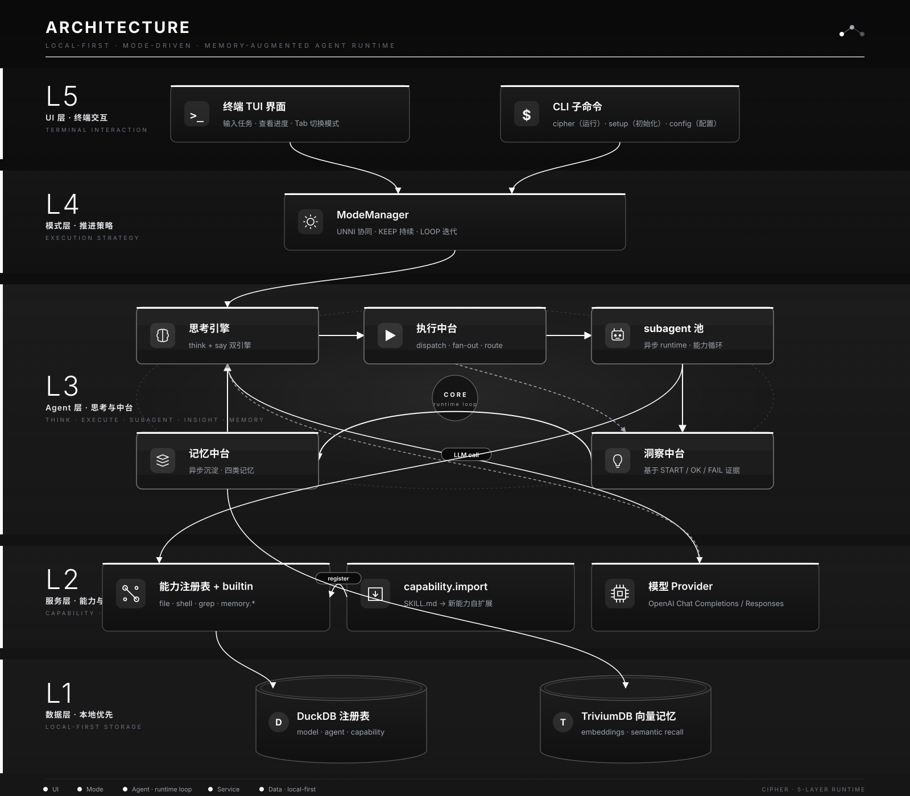

# Cipher — 自主管理、持续理解、持续学习的终端 Agent 框架

> 让 AI 适应人，而不是让人迁就 AI。

Cipher 是一个终端原生的 AI Agent 框架。它不是一次性响应机器，而是一个**持续思考对象**——你在终端里输入任务，Cipher 理解意图、自主执行、沉淀记忆、持续迭代。

- **自主管理**：把目标交给 Cipher 后即可放手，它自主推进直至完成
- **持续理解**：随着交互深入，Cipher 不断积累经验、学习偏好、形成认知
- **持续学习**：记忆系统自动沉淀注意力、经验、偏好、认知四类记忆，越用越懂你

所有数据保存在本地（DuckDB 注册表 + TriviumDB 向量记忆），隐私可控。

---

## 核心特性

- **双引擎思考**：think 引擎专注内部思考与执行意图，say 引擎负责面向用户的回复，二者分离协同
- **三中台架构**：执行中台（调度 subagent 执行真实任务）、洞察中台（基于证据复核方向）、记忆中台（异步沉淀四类记忆）
- **三种工作模式**：UNNI 协同、KEEP 持续、LOOP 迭代，Tab 键随时切换
- **本地记忆系统**：注意力、经验、偏好、认知四类记忆自动沉淀，向量检索，本地优先
- **Subagent 体系**：异步 runtime，能力循环，失败重试闭环，证据落盘
- **自扩展闭环**：SKILL.md → `capability.import` → 新能力注册执行，无需修改代码
- **安全执行**：builtin 能力直连 host（路径白名单、读写预算、危险命令黑名单）
- **多模型支持**：通过 OpenAI Chat Completions 和 Responses 协议接入，兼容多厂商模型

---

## 架构

Cipher 采用五层单向依赖架构（L1 数据层不感知上层），核心循环在 Agent 层内闭环。

<p align="center">
  
</p>

**架构说明**：
- 五层依赖单向：L1 数据层不感知上层，UI 在最顶，调用方向从上到下
- 核心循环在 Agent 层内闭环：思考 → 执行（subagent 真实运行）→ 洞察复核 → 记忆沉淀 → 回到思考
- 与用户对话的**唯一主体 = 思考引擎**（think/say 双引擎）；三中台输出是思考引擎的输入或内部沉淀，不直接推给用户

---

## 快速上手

### 安装

**方式一：下载预编译二进制（推荐）**

一行命令，无需 Rust 工具链，自动检测 OS 和架构：

```bash
bash <(curl -sL https://github.com/NoxTyrannus/cipher/raw/main/install.sh) --download
```

Windows 用 PowerShell：

```powershell
powershell -Command "iwr -Uri https://github.com/NoxTyrannus/cipher/raw/main/install.ps1 -OutFile install.ps1; .\install.ps1 -Download"
```

`install.sh --download` 自动检测平台（Linux x86_64/arm64、macOS x86_64/arm64、Windows x86_64/arm64），从 GitHub Release 下载对应安装包，安装到 `~/.local/bin`。

每个 Release 附 `SHA256SUMS.txt`，可用 `sha256sum -c` 校验下载完整性。

**方式二：源码构建安装**

前置要求：Rust 工具链（`rustup` 按 `rust-toolchain.toml` 自动安装）。

```bash
git clone https://github.com/NoxTyrannus/cipher.git
cd cipher
bash install.sh
```

`install.sh` 自动检查工具链、构建并安装到 `~/.local/bin`。

### 初始化

```bash
cipher setup
```

引导配置：选择模型供应商 → 填写模型标识与 API key → 连接性验证。也可随时用 `cipher config` 管理模型与配置。

### 启动

```bash
cipher
```

进入 TUI 交互界面。可选全局参数：`--config <路径>` / `--data-dir <路径>`。

---

## 三种工作模式

Cipher 提供三种工作模式，Tab 键循环切换（UNNI → KEEP → LOOP → UNNI），适应不同协作深度。

### UNNI 协同模式

此模式用于用户需要**不断提出需求、想法、思考**的场景。在此模式下，Agent 高度协同你的意图，你无需关注细节，只需不断输入信息，Agent 会自行组织信息、不断完善执行。

> 当前版本暂未设计产物展示功能。

### KEEP 持续模式

此模式用于用户需要 Agent **协同目标并自主完善**的场景。在此模式下，你把目标交给 Agent 后即可持续运行，期间可以随时输入更多指令以间接影响 Agent 的执行思路。

### LOOP 迭代模式

此模式用于 Agent **完全凭借记忆自行发现任务、自我完善**的场景。在此模式下，Agent 基于已积累的记忆和用户偏好主动推进——此模式有效循环的前提是积累了足够的记忆并了解用户偏好。

---

## 记忆系统

Cipher 内置四类记忆自动沉淀：注意力（当前关注）、经验（执行总结）、偏好（用户习惯）、认知（关系图谱）。所有记忆通过 TriviumDB 向量检索，本地存储，不依赖云端。

---

## 配置

配置文件：`~/.cipher/config.toml`（首次运行自动创建）。

| 配置项 | 说明 | 默认值 |
|---|---|---|
| `data_dir` | 数据目录（注册表/记忆/产物） | `~/.cipher/data` |
| `default_mode` | 默认工作模式（unni / keep / loop） | `unni` |
| `default_model` | 默认模型（注册表中的模型标识） | 无 |
| `mode_styles.keep.token_budget` | KEEP 模式 Token 预算（0=无限） | `0` |
| `mode_styles.keep.time_budget_secs` | KEEP 模式时间预算秒数（0=无限） | `0` |

身份自定义：在 TUI 中输入 `/config` 进入配置面板 → Agent 改名，或直接编辑数据目录下 `prompts/SOUL.md`。

---

## 模型支持

Cipher 通过两种协议接入 LLM：

| 协议 | 说明 |
|---|---|
| OpenAI Chat Completions | 兼容绝大多数厂商的 API |
| OpenAI Responses | 新一代 OpenAI 响应式 API |

兼容厂商示例：DeepSeek、MiniMax（M3）、月之暗面（Kimi）、智谱AI（GLM）、字节跳动（Doubao）、商汤科技（SenseNova）等。

模型温度、采样参数等可在 `cipher setup` 或 `cipher config` 中配置。

---

## 自扩展

Cipher 支持通过 `capability.import` 在运行时导入新能力：

1. 编写 SKILL.md（描述能力行为）
2. Cipher 读取并转换为 `capability.import` JSON
3. 注册到能力注册表，授权给 agent
4. 即可直接使用

此能力已通过真实模型验证：从外部 SKILL.md 导入并成功执行新能力，全链路闭环。

---

## 隐私

- API key 仅保存在本地模型注册表（`data_dir` 内），不写入日志
- 所有数据（对话、记忆、产物）本地存储，不依赖云端
- LLM 请求仅发送必要上下文

---

## 工程与质量

| 层级 | 内容 |
|---|---|
| L1 门禁 | `cargo test --lib` + `cargo clippy -D warnings` + `cargo fmt --check`，全绿 |
| L2 探针题库 | PTY 驱动真实 API 测试，覆盖三模式行为矩阵 |
| L3 手动冒烟 | 真实 TUI 场景验证，含记忆召回验证 |

---

## License

MIT License — 详见 [LICENSE](LICENSE)。